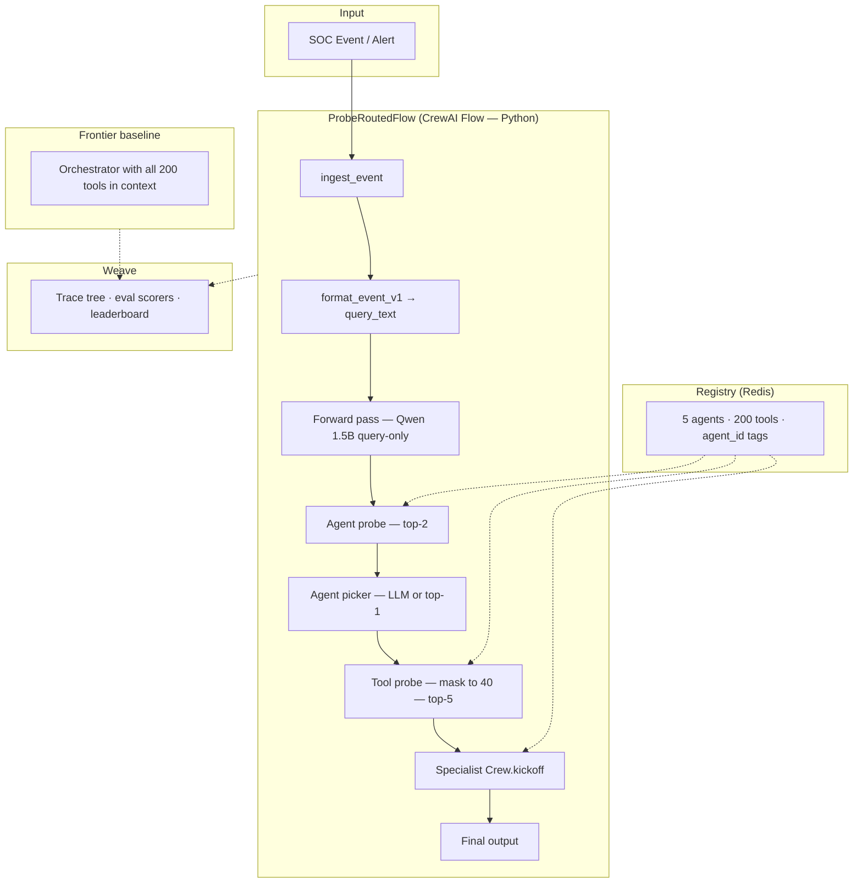

# Probe-Routed SOC Triage — System Architecture

**Event:** WeaveHacks 4 — Multi-Agent Orchestration  
**Claim:** Route SOC alerts to the correct specialist agent and tools **faster and cheaper** than a frontier orchestrator with all 200 tools in context — at equal-or-better routing accuracy.

**Related docs:** [idea.md](idea.md) (decision log) · [data/SYNTHETIC_DATA_PLAN.md](data/SYNTHETIC_DATA_PLAN.md) (training data & probes)

---

## 1. What we are building

A **probe-routed multi-agent system** for a security operations center (SOC) triage desk:

- Incoming alerts are normalized into a fixed `query_text` format.
- A **frozen small LLM** (Qwen 1.5B) runs a query-only forward pass; we read hidden states, not generated text.
- Two **linear probes** (LogReg) on those hidden states shortlist agents and tools.
- A **specialist CrewAI crew** receives only the top-5 tools and executes the investigation.
- **Weave** traces every hop: probe confidences, tokens, latency, cost.

The system **routes and triages**. It does **not** detect or block attacks.

---

## 2. Scale (v1)


| Dimension            | Value                                           |
| -------------------- | ----------------------------------------------- |
| Sub-agents           | **5** specialist crews                          |
| Tools                | **200 total** (40 per agent)                    |
| Tool implementations | **All mock** — no real API calls in v1          |
| Routing hops (v1)    | **Single-hop** — one agent, one execution, done |
| Agent shortlist      | Top **2** (recall@2)                            |
| Tool shortlist       | Top **5** after masking (recall@5)              |


---

## 3. High-level architecture




**Orchestrator = CrewAI Flow (deterministic Python).**  
We do **not** use `Process.hierarchical` / a manager agent as the router — that pattern is the baseline we beat.

---

## 4. Request path (single-hop v1)

```
SOC event
  → format_event_v1(event)           # locked string format
  → query_text

  → Qwen 1.5B forward pass           # no generation, no tool schemas
  → h = residual[last_layer, last_token]

  → agent_probe(h) → top-2 agent_ids
  → pick 1 agent                     # LLM over 2, or argmax

  → tool_probe(h) → scores[200]
  → zero scores for tools where agent_id ≠ chosen agent  # 160 zeroed, 40 remain
  → top-5 tool_ids

  → specialist_crew[agent_id].kickoff(
        inputs={"context": query_text},
        tools=top_5_from_registry
    )
  → result
```

One forward pass feeds **both** probes. The agent choice only changes the **tool mask**, not the hidden state.

### Context contract

The **same** `query_text` is used for:

1. Probe forward pass (training + inference)
2. Specialist crew `{context}` input
3. Weave eval holdout rows

Probe scores are logged to Weave traces. They are **not** injected into agent prompts.

---

## 5. Component breakdown

### 5.1 Event ingestion

**Responsibility:** Accept raw SOC alerts (simulated feed or static eval set) and normalize to structured `event` dict.

```python
event = {
    "event_type": "authentication_anomaly",
    "severity": "high",
    "summary": "...",
    "assets": "...",
    "indicators": "...",
}
query_text = format_event_v1(event)
```

**Formatter (locked v1):**

```
NEW SOC EVENT
Type: {event_type}
Severity: {severity}
Summary: {summary}
Assets: {assets}
Indicators: {indicators}
Action needed: Route to the correct specialist and investigate.
```

### 5.2 Feature extractor (frozen LLM)


| Property | Value                                             |
| -------- | ------------------------------------------------- |
| Model    | Qwen 1.5B (open weights)                          |
| Mode     | Forward pass only — **no decoding**               |
| Input    | `query_text` only                                 |
| Layer    | **Last transformer layer** (`L = num_layers - 1`) |
| Token    | **Last input token** (`-1`)                       |
| Output   | `h ∈ R^d_model`                                   |


No layer sweep, no mean pooling in v1. Train and inference settings must match exactly.

**Hosting:** Modal GPU for extraction and optional co-located inference.

### 5.3 Agent probe


| Property | Value                            |
| -------- | -------------------------------- |
| Input    | Hidden state `h`                 |
| Model    | LogisticRegression (multinomial) |
| Classes  | 5 `agent_id`s                    |
| Output   | Top-2 agents + confidence scores |
| Metric   | recall@2                         |


**Role:** Narrow 5 agents → 2. The picker (small LLM or argmax) chooses 1.

### 5.4 Tool probe


| Property  | Value                                                   |
| --------- | ------------------------------------------------------- |
| Input     | Same hidden state `h`                                   |
| Model     | LogisticRegression (multinomial)                        |
| Classes   | 200 `tool_id`s (trained unmasked)                       |
| Inference | Score all 200 → **mask to 40** for chosen agent → top-5 |
| Metric    | recall@5 (40-way effective pool)                        |


**Role:** Narrow 40 agent-local tools → 5. Specialist agent reasons over the 5 and executes.

### 5.5 Agent picker (optional LLM)

After agent probe returns top-2:

- **v1 default:** take probe top-1, or
- **v1+ :** small LLM chooses between 2 candidates (cheap — only 2 options)

This is **not** the router. The probe already did the heavy lifting.

### 5.6 Specialist crews (CrewAI)

One **Crew** per sub-agent (5 total). Each crew is the same shape — only the specialist label and tool set change. Routing is already done; the agent **investigates**, it does not dispatch.

**Agent design constraints (v1):**


| Rule                     | Why                                                         |
| ------------------------ | ----------------------------------------------------------- |
| `allow_delegation=False` | Single specialist, single hop — no sub-routing              |
| Tools = probe top-5 only | Agent never sees the 200-tool catalog                       |
| Input = `{context}` only | Same `query_text` the probes saw; no probe scores in prompt |
| One task per kickoff     | No task chains; investigation → triage note → done          |
| `max_iter=5`             | Enough for 2–3 tool calls + final answer; caps cost         |


See **§5.6.1** for the full agent + task definition.


| agent_id           | Role                       |
| ------------------ | -------------------------- |
| `log_search`       | SIEM / log correlation     |
| `threat_intel`     | IOC enrichment, reputation |
| `malware_analysis` | Files, hashes, sandbox     |
| `network_analysis` | Firewall, DNS, NetFlow     |
| `email_security`   | Phishing, BEC, attachments |


40 tools each — **all mock stubs** (see §5.6.2). No Slack, SIEM, or VirusTotal wiring in v1.

#### 5.6.2 Mock tools (v1 — no real integrations)

Every tool is a **stub function**. None call external APIs. This is intentional:

- **Routing accuracy** depends on labels and probe training, not live tool output.
- **Demo reliability** — no API keys, rate limits, or network failures during the hackathon.
- **Fair baseline comparison** — frontier orchestrator and probe router use the **same** mock tools at execution time.

**Stub pattern:** log the call (print or Weave span), return a fixed JSON string shaped like a plausible API response.

```python
from crewai.tools import tool

@tool("search_auth_logs")
def search_auth_logs(source_ip: str, hostname: str, window_minutes: int = 15) -> str:
    """Query SIEM for login and MFA events."""
    print(f"[mock] search_auth_logs source_ip={source_ip} hostname={hostname} window={window_minutes}m")
    return (
        '{"hits": 847, "source_ip": "' + source_ip + '", '
        '"hostname": "' + hostname + '", "success_count": 0, '
        '"failed_users": ["root", "admin"]}'
    )
```

**Registry:** each tool entry still has `name` and `description` (used in the agent's 5-tool shortlist and for probe labels). Drop `"integration": "real"` — everything is `"mock"`.

**Generation:** one stub module per agent (`src/tools/log_search.py`, etc.) or a single factory that builds stubs from `registry.json` metadata. Descriptions must read realistically so the **LLM picks sensibly among the 5**; return values can be static or keyed lightly off inputs (e.g. echo `source_ip` from the alert).

**What we measure on execution:** tool was invoked (Weave trace), agent output is valid JSON — not whether the mock data is "correct."

A **single agent template** parameterized by specialist domain. All five crews use this pattern — copy the YAML, swap `specialty` and tools.

**What the agent does:** read the alert, call 1–3 of the five tools provided, write a short triage note.  
**What it does not do:** route to other agents, pick tools outside the shortlist, or claim to block/remediate.

##### Agent config (`config/agents.yaml`)

```yaml
soc_specialist:
  role: >
    {specialty} SOC Analyst
  goal: >
    Investigate the assigned alert using only the tools provided.
    Summarize findings and recommend the next triage step.
    Do not route to other teams — routing is already handled.
  backstory: >
    You are a tier-1 SOC analyst focused on {specialty}.
    You work concisely: gather evidence with tools, state facts, avoid speculation.
    You never invent log lines, IOC verdicts, or tool output.
  allow_delegation: false
  verbose: true
  max_iter: 5
```

Specialty strings per `agent_id`:


| agent_id           | `{specialty}` value                       |
| ------------------ | ----------------------------------------- |
| `log_search`       | SIEM log search and correlation           |
| `threat_intel`     | threat intelligence and IOC enrichment    |
| `malware_analysis` | malware and endpoint forensics            |
| `network_analysis` | network traffic and DNS analysis          |
| `email_security`   | email security and phishing investigation |


##### Task config (`config/tasks.yaml`)

```yaml
investigate_alert:
  description: >
    Investigate this SOC alert:

    {context}

    Instructions:
    1. Read the alert type, severity, assets, and indicators.
    2. Choose the most relevant tools from those available (you have at most five).
    3. Call tools to gather evidence — prefer fewer, targeted calls.
    4. If tools return no hits, say so explicitly.
    5. Do not recommend routing to another team; state what this specialist found.

  expected_output: >
    A JSON object with exactly these keys:
    - "alert_summary": one sentence restating the alert
    - "tools_used": list of tool names called (may be empty)
    - "findings": bullet list of factual observations from tool output
    - "severity_assessment": "unchanged" | "escalate" | "downgrade" with one-line reason
    - "recommended_next_step": one concrete action for the SOC queue (e.g. "correlate with VPN logs", "submit hash to sandbox")

    Return valid JSON only, no markdown fences.

  agent: soc_specialist
```

The task description is intentionally minimal — **probe routing already picked the right specialist and tools**. The agent's job is execution and summarization, not catalog search.

##### Crew factory (`src/crews/specialist.py`)

```python
from crewai import Agent, Crew, Process, Task

SPECIALTY = {
    "log_search": "SIEM log search and correlation",
    "threat_intel": "threat intelligence and IOC enrichment",
    "malware_analysis": "malware and endpoint forensics",
    "network_analysis": "network traffic and DNS analysis",
    "email_security": "email security and phishing investigation",
}

def build_specialist_crew(agent_id: str, tools: list, agents_config: dict, tasks_config: dict) -> Crew:
    specialty = SPECIALTY[agent_id]

    agent = Agent(
        config={
            **agents_config["soc_specialist"],
            "role": agents_config["soc_specialist"]["role"].format(specialty=specialty),
            "goal": agents_config["soc_specialist"]["goal"].format(specialty=specialty),
            "backstory": agents_config["soc_specialist"]["backstory"].format(specialty=specialty),
        },
        tools=tools,
    )

    task = Task(
        config=tasks_config["investigate_alert"],
        agent=agent,
    )

    return Crew(agents=[agent], tasks=[task], process=Process.sequential, verbose=True)
```

Called from the Flow after probing:

```python
tools = resolve_tools(tool_ids)          # 5 tools from registry
crew = build_specialist_crew(agent_id, tools, agents_config, tasks_config)
result = crew.kickoff(inputs={"context": query_text})
```

##### Example: `log_search` on a brute-force alert

**Input** (`query_text` — same string the probes saw):

```
NEW SOC EVENT
Type: authentication_anomaly
Severity: high
Summary: 847 failed SSH login attempts from 203.0.113.44 against prod-bastion-01 in the last 15 minutes.
Assets: prod-bastion-01
Indicators: source_ip=203.0.113.44, user=root, protocol=ssh
Action needed: Route to the correct specialist and investigate.
```

**Probe shortlist** (illustrative): `search_auth_logs`, `correlate_by_source_ip`, `query_failed_logins`, `lookup_asset_owner`, `export_siem_timeline`

**Example agent output:**

```json
{
  "alert_summary": "High-volume failed SSH logins to prod-bastion-01 from 203.0.113.44 targeting root.",
  "tools_used": ["search_auth_logs", "correlate_by_source_ip"],
  "findings": [
    "847 failed SSH attempts in 15 minutes from 203.0.113.44",
    "Same source IP attempted logins against 2 other hosts in the subnet",
    "No successful authentication from this IP in the last 24h"
  ],
  "severity_assessment": "unchanged — volume and root targeting justify high severity",
  "recommended_next_step": "Block 203.0.113.44 at edge firewall and open incident for credential-spray pattern"
}
```

All tools are mocks — they return canned JSON (see §5.6.2). Routing eval cares about **which agent and tools were selected**; execution eval checks JSON shape, tool calls in the Weave trace, and that stubs ran without error.

##### Why this stays simple

- **One agent, one task** per crew — no manager, no delegation, no multi-agent debate.
- **Same template × 5** — only `specialty` and the probe-picked tools differ.
- **Structured JSON output** — easy to score, display in CopilotKit, and attach to Weave traces.
- **Routing is out of scope for the LLM** — probes + Flow handle that; the agent cannot "choose wrong team" because it never sees other teams' tools.

### 5.7 Registry (Redis)

**Source of truth** for routing and execution:

```json
{
  "agents": [{ "agent_id", "name", "description", "crew_module" }],
  "tools": [{ "tool_id", "agent_id", "name", "description" }]
}
```

Used by:

- Probe training label vocabularies
- Tool masking at inference (`agent_id` tag)
- Loading mock tool stubs for specialist crews
- RAG baseline vector store (optional comparison arm)

### 5.8 Orchestrator (CrewAI Flow)

Python Flow class — explicit control flow, not LLM-driven routing:

```python
class ProbeRoutedFlow(Flow):
    @start()
    def ingest(self):
        self.state.query_text = format_event_v1(self.state.event)
        return self.state

    @listen(ingest)
    def route_and_execute(self):
        h = extract_hidden_state(self.state.query_text)
        agents = agent_probe.top_k(h, k=2)
        agent_id = pick_agent(agents)
        tools = tool_probe.top_k_masked(h, agent_id, k=5)
        crew = load_crew(agent_id)
        self.state.result = crew.kickoff(
            inputs={"context": self.state.query_text},
            tools=resolve_tools(tools),
        )
        return self.state
```

v1 terminates after one `route_and_execute`. Multi-hop re-probing is roadmap (see §9).

### 5.9 Weave observability

Every run produces a trace tree:

```
ingest_event
  → forward_pass (layer, token_pos, model_id)
  → agent_probe (top-2, confidences)
  → agent_pick (chosen agent_id)
  → tool_probe (top-5, confidences, mask applied)
  → crew_execution (tokens, latency, tool calls)
```

**Evaluations:**

- Holdout set: `(query_text → correct agent_id, correct tool_id)`
- Scorers: agent recall@2, tool recall@5, end-to-end accuracy
- Compare: **probe router** vs **frontier in-context (200 tools)** vs **RAG baseline**
- Log tokens, latency, $ per arm on the same queries

### 5.10 Frontier baseline

Single orchestrator LLM with **all 200 tool schemas** in context. Same `query_text` input. Measures what we replace:

- Higher token cost
- Lower routing accuracy at scale
- Same mock execution stubs once tool is chosen

Apples-to-apples: same eval set, same mock tool layer for every arm.

---

## 6. Probe training pipeline

Detailed in [data/SYNTHETIC_DATA_PLAN.md](data/SYNTHETIC_DATA_PLAN.md). Summary:

```
registry.json + templates.json
  → generate_dataset.py
  → agent_probe_train.jsonl  (query_text, agent_id)
  → tool_probe_train.jsonl   (query_text, tool_id)   # same rows

  → extract_activations.py   # last layer, last token
  → train_probes.py          # LogReg × 2 on same h matrix
  → probes/agent_probe.joblib
  → probes/tool_probe.joblib
  → probes/probe_config.json
```

**Labels:** synthetic from templates — ground truth by construction, never LLM self-labeling.

**Sizing:** 50–100 examples per tool → ~15k rows at full scale; 250-row pilot (5 tools × 50) for hour-3 validation.

---

## 7. Metrics funnel

Log each stage separately — end-to-end accuracy is their product:

```
agent recall@2  →  pick agent  →  tool recall@5  →  agent picks tool  →  execute
```


| Stage          | What we measure                       |
| -------------- | ------------------------------------- |
| Agent probe    | top-1 acc, recall@2                   |
| Agent picker   | pick accuracy (when using LLM over 2) |
| Tool probe     | top-1 acc, recall@5 (40-way masked)   |
| Tool execution | mock stub invoked, valid agent JSON   |
| System         | tokens, latency, cost vs baseline     |


---

## 8. Directory layout (target)

```
ideation_for_weavehacks/
├── ARCHITECTURE.md              # this file
├── idea.md                      # decision log
├── data/
│   ├── registry.json            # 5 agents, 200 tools
│   ├── templates.json           # synthetic scenario templates
│   ├── agent_probe_train.jsonl
│   ├── tool_probe_train.jsonl
│   └── eval_holdout.jsonl
├── probes/
│   ├── agent_probe.joblib
│   ├── tool_probe.joblib
│   └── probe_config.json
├── src/
│   ├── formatters.py            # format_event_v1
│   ├── extract_activations.py
│   ├── probes.py                # load + infer
│   ├── tools/                   # mock @tool stubs (one module or factory)
│   ├── config/
│   │   ├── agents.yaml          # soc_specialist template
│   │   └── tasks.yaml           # investigate_alert task
│   ├── flow.py                  # ProbeRoutedFlow
│   └── crews/
│       └── specialist.py        # build_specialist_crew()
├── scripts/
│   ├── generate_dataset.py
│   └── train_probes.py
└── diagrams/
    └── probe-routed-architecture.mmd
```

---

## 9. Roadmap (post-v1)


| Feature                                                  | Status             |
| -------------------------------------------------------- | ------------------ |
| Single-hop routing                                       | **v1 — ship this** |
| Multi-hop: re-probe after agent result updates context   | Roadmap            |
| SAE features (Gemma Scope) for explainable routing       | Roadmap            |
| Activation patching / steering demos                     | Roadmap            |
| RAG → probe hybrid shortlist                             | Roadmap            |
| Adaptive k (shortlist size from probe confidence spread) | Roadmap            |
| Layer sweep / multi-layer concat                         | Research only      |


Multi-hop loop (future):

```
event → probe → agent executes → append result to context
      → new forward pass on updated context → probe again → …
```

Each hop gets its own forward pass when context genuinely changes.

---

## 10. Design principles

1. **Probe = filter, not decision maker.** Shortlist at both levels; agent/LLM picks from small sets.
2. **Query-only forward pass.** No tool schemas in the probe path — train/inference parity is load-bearing.
3. **External probes.** Separate module between steps; enables multi-hop and swapping probes without retraining the LLM.
4. **Closed-set routing.** New tools/agents → offline relabel + retrain (cheap). Honest tradeoff vs RAG open-set.
5. **No hierarchical manager router.** Flow + probes in Python; CrewAI hierarchical is the comparison baseline.
6. **Visibility wins demos.** Live token/cost counters, probe confidence in UI, leaderboard vs frontier.

---

## 11. Build order

Thin vertical slice first. Each stage is independently demoable.


| #   | Milestone                                  | Done when                    |
| --- | ------------------------------------------ | ---------------------------- |
| 1   | Agent probe + held-out accuracy            | recall@2 number on pilot set |
| 2   | Minimal E2E: query → probe → one crew runs | Weave trace visible          |
| 3   | Tool probe + masking + top-5               | Full single-hop architecture |
| 4   | Frontier baseline + Weave eval leaderboard | apples-to-apples comparison  |
| 5   | Attack-sim UI (CopilotKit cockpit)         | polish layer                 |


Data generation and probe training run in parallel with steps 1–3. See [data/SYNTHETIC_DATA_PLAN.md](data/SYNTHETIC_DATA_PLAN.md) for the data-side build order.

---

## 12. Honesty boundaries

- We **route** alerts to the right specialist and tools.
- We do **not** claim to detect, prevent, or stop breaches.
- Probe routing is **closed-set** — new tools need retraining.
- SAE feature names (if added later) are hypotheses, not ground truth.
- Latency may be similar to one big call; the win is **cost + routing accuracy**.

