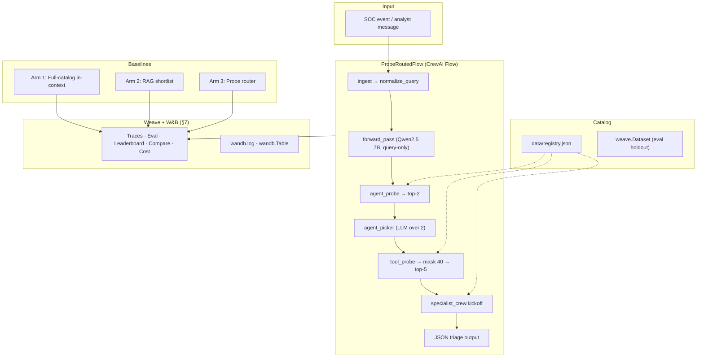
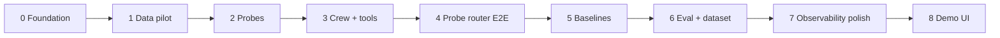
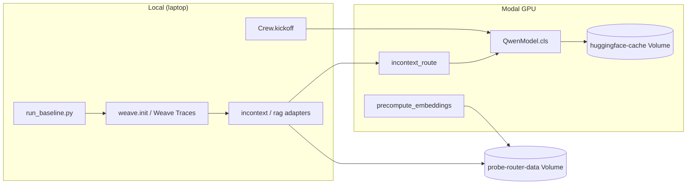

# Probe-Routed SOC Triage — Final Agent Architecture

**Event:** WeaveHacks 4 — Multi-Agent Orchestration (June 6–7, 2026)  
**Claim:** Route SOC alerts to the correct specialist agent and tools **faster and cheaper** than a full-catalog in-context baseline — at equal-or-better routing accuracy.

**Related docs:** [idea.md](idea.md) (rationale) · [data/SYNTHETIC_DATA_PLAN.md](data/SYNTHETIC_DATA_PLAN.md) (probe training) · [ARCHITECTURE.md](ARCHITECTURE.md) (earlier draft — superseded by this file for implementation) · [wandb-docs/](wandb-docs/) (local Weave/WB reference)

**Implementation:** Follow **§14** stage-by-stage. Complete acceptance criteria for stage *N* before starting stage *N+1*. Each stage lists files, scope boundaries, and verification commands for LLM agents.

---

## 1. What we are building

A **probe-routed multi-agent system** for a security operations center (SOC) triage desk:


| Layer             | Responsibility                                                                                               |
| ----------------- | ------------------------------------------------------------------------------------------------------------ |
| **Router**        | Frozen LLM forward pass + two LogReg probes → shortlist agent + tools                                        |
| **Orchestrator**  | CrewAI **Flow** (deterministic Python) — not an LLM manager                                                  |
| **Specialists**   | Five CrewAI crews — one agent, one task, probe-picked tools only                                             |
| **Observability** | **Weave** tracing + **Evaluation** + **Leaderboard**; **W&B** probe-training metrics + per-query tables (§7) |


The system **routes and triages**. It does **not** detect, block, or remediate attacks.

---

## 2. Locked decisions (from design review)


| Decision        | Choice                                            | Notes                                                       |
| --------------- | ------------------------------------------------- | ----------------------------------------------------------- |
| Probe backbone  | `Qwen/Qwen2.5-7B-Instruct`                | Frozen; forward pass only for probes                        |
| Execution LLM   | `Qwen/Qwen2.5-7B-Instruct`                | CrewAI specialist agent via Modal `QwenModel.generate`      |
| Activation site | Last layer, last token (`h = residual[L, -1]`)    | No layer sweep in v1                                        |
| Routing hops    | **Single-hop** v1                                 | Multi-hop re-probing is roadmap                             |
| Agent probe     | Top **2** agents (recall@2)                       |                                                             |
| Agent picker    | **Small LLM** chooses 1 of 2                      | Not argmax-only                                             |
| Tool probe      | Score 200 → **mask to 40** → top **5** (recall@5) | Train unmasked; mask at inference                           |
| Tool execution  | **All mock** stubs                                | 200 tools, `"integration": "mock"`                          |
| Query contract  | **Natural language** (recommended — see §4)       | Train/inference/eval must match                             |
| Registry source | `data/registry.json` + Weave Datasets for eval    | W&B has no live vector DB (see §6.7)                        |
| Baseline arms   | **3:** full-catalog in-context · RAG · probe router | Same `weave.Dataset`; leaderboard from eval runs (§7.2–7.3) |
| Arm 1 LLM       | `Qwen/Qwen2.5-7B-Instruct` on **Modal GPU** (self-hosted HF) | Same backbone as probe; **no** W&B Serverless Inference |
| RAG embeddings  | Modal GPU + `sentence-transformers` (`BAAI/bge-small-en-v1.5`) | Precompute to Volume (Stage 5); cosine retrieval local |
| Baseline compute | **Hybrid:** Modal GPU + local Weave/CrewAI | Qwen weights on Modal only; crews `kickoff()` local, LLM via Modal `.remote()` |


---

## 3. Scale (from `data/registry.json`)


| Dimension    | Value                                           |
| ------------ | ----------------------------------------------- |
| Sub-agents   | **5** specialist crews                          |
| Tools        | **200 total** (40 per agent)                    |
| Integrations | **All mock** in v1                              |
| Routing      | **Single-hop** — one agent, one execution, done |


### Specialist fleet


| `agent_id`         | Role                       | Example tools (of 40)                                                                               |
| ------------------ | -------------------------- | --------------------------------------------------------------------------------------------------- |
| `log_search`       | SIEM / log correlation     | `search_auth_logs`, `correlate_by_source_ip`, `build_event_timeline`, `search_impossible_travel`, … |
| `threat_intel`     | IOC enrichment, reputation | `lookup_ip_reputation`, `enrich_ioc_bulk`, `lookup_passive_dns`, …                                  |
| `malware_analysis` | Files, hashes, sandbox     | `submit_file_to_sandbox`, `compute_file_hashes`, `extract_pe_metadata`, …                           |
| `network_analysis` | Firewall, DNS, NetFlow     | `query_netflow_records`, `detect_beaconing_pattern`, `analyze_traffic_volume`, …                    |
| `email_security`   | Phishing, BEC, attachments | `parse_email_headers`, `check_spf_result`, `check_dkim_signature`, …                                |


Each tool entry: `{ tool_id, agent_id, name, description, integration: "mock" }`.  
Each agent entry: `{ agent_id, name, description, crew_module: "src.crews.specialist" }`.

---

## 4. Query / context contract (recommended: natural language)

**Recommendation:** Use **plain natural-language analyst messages** as the canonical `query_text` everywhere — probe training, probe inference, specialist `{context}`, and Weave eval rows.

**Why (resolves doc conflict):**

- Aligns with [data/SYNTHETIC_DATA_PLAN.md](data/SYNTHETIC_DATA_PLAN.md) and the locked **Qwen2.5 7B** probe model.
- Matches how analysts actually type into a triage agent (better demo story).
- Avoids silent accuracy collapse from train-on-NL / infer-on-ticket mismatch.

**Rules:**

```python
def normalize_query(text: str) -> str:
    """Light cleanup only. Do not wrap into ticket templates."""
    return text.strip()
```

**Good `query_text`:**

> We're seeing 847 failed SSH logins to prod-bastion-01 from 203.0.113.44 in the last 15 minutes, mostly root — can someone pull auth logs?

**Avoid in `query_text`:** labeled fields (`Type:`, `Severity:`), `NEW SOC EVENT` headers, JSON blobs, tool schemas.

**UI ingest:** If CopilotKit or a sim feed emits structured alerts, convert to NL **once** at the Flow boundary (`ingest_event → to_analyst_message(event) → query_text`) before any probe or crew call. Never feed structured tickets to probes while training on NL.

**Probe path:** `query_text` only — **no tool schemas** in the forward pass.

---

## 5. High-level architecture




**Orchestrator = CrewAI Flow.** We do **not** use `Process.hierarchical` / manager-as-router — that pattern belongs to baseline comparisons only.

---

## 6. Request path (single-hop v1)

```
SOC input
  → normalize_query(...)              # NL string; same contract as training

  → Qwen2.5 7B forward pass         # no generation, no tool schemas
  → h = residual_stream[L, pos=-1]    # see §6.1 — pre-final-norm, last input token

  → agent_probe(h) → top-2 agent_ids + confidences
  → agent_picker(top-2, query_text)   # LLM picks 1 (see §6.2)

  → tool_probe(h) → scores[200]
  → zero scores where tool.agent_id ≠ chosen_agent   # 160 zeroed, 40 remain
  → top-5 tool_ids + confidences

  → specialist_crew[agent_id].kickoff(
        inputs={"context": query_text},
        tools=resolve_tools(top_5)     # mock @tool stubs from registry
    )
  → JSON triage result
```

One forward pass feeds **both** probes. Agent choice only changes the **tool mask**, not `h`.

Probe scores are logged to Weave. They are **not** injected into specialist prompts.

---

## 6.1 Feature extractor — extracting `h` (frozen LLM)

This step implements a **linear probing classifier input** (see mech_interp: probing classifiers, LAT, residual stream). We read the model's **residual stream** — the shared additive representation each layer reads and writes to — not logits, not attention patterns, and not a single head/MLP output in isolation.

### What `h` is (mechanistic interpretability)


| Concept                     | Our choice                                           | Why                                                                                                  |
| --------------------------- | ---------------------------------------------------- | ---------------------------------------------------------------------------------------------------- |
| **Representation**          | Residual stream vector at one `(layer, token)`       | Probes ask: "what information is **linearly decodable** from this activation?"                       |
| **Hook point (TLens name)** | `blocks.{L}.hook_resid_post`                         | Post-block residual **before** the model's final RMSNorm                                             |
| **Layer `L`**               | `L = num_hidden_layers - 1` (final block, 0-indexed) | Deepest context integration before unembedding; v1 skips layer sweep                                 |
| **Token `pos`**             | `-1` (last token of the **input** sequence)          | Causal LM: last token attended to full query; do **not** mean-pool                                   |
| **Architecture note**       | Qwen2.5 is **pre-norm RMSNorm** (Llama-style)        | MI analyzes the **raw residual** (`hook_resid_pre/post`), not `RMSNorm(residual)` fed into sublayers |


**Honesty boundary:** high probe accuracy means the route label is **linearly encoded** in `h`, not that the model **causally uses** that encoding for routing (correlation ≠ causation). That is acceptable for a learned router filter; do not claim mechanistic proof of internal routing circuits in v1.

### What `h` is not


| Do not use                                                                          | Reason                                                    |
| ----------------------------------------------------------------------------------- | --------------------------------------------------------- |
| `lm_head` logits / generated tokens                                                 | Probe path has **no decoding**                            |
| Mean/max pool over sequence                                                         | Dilutes localized routing signal; v1 uses last token only |
| Attention pattern or single-head output                                             | Not the full residual representation                      |
| Tool schemas / registry text in the prompt                                          | Changes activations; breaks train/inference parity        |
| `last_hidden_state` after **final** RMSNorm (unless explicitly matched in training) | Different geometry than post-block residual               |


### Forward-pass contract (train = inference)

Every field below must be **identical** in `modal/extract_activations.py` and runtime `src/probes.py`:


| Setting       | v1 value                                                                                                              |
| ------------- | --------------------------------------------------------------------------------------------------------------------- |
| Model         | `Qwen/Qwen2.5-7B-Instruct`                                                                                    |
| Mode          | `model.eval()`, `torch.no_grad()`                                                                                     |
| Generation    | **Disabled** — single prefill forward pass only                                                                       |
| Input text    | `normalize_query(query_text)` — NL only, no tools                                                                     |
| Chat template | Single-turn user message; `add_generation_prompt=False` so the last token is **content**, not an empty assistant slot |
| Truncation    | Fixed `max_length` (e.g. 512); same side (`left`/`right`) train and infer                                             |
| Dtype         | e.g. `bfloat16` on GPU — record in `probe_config.json`                                                                |
| Layer index   | `L = config.num_hidden_layers - 1`                                                                                    |
| Token index   | `pos = input_ids.shape[-1] - 1` after tokenization                                                                    |


### HuggingFace extraction (reference implementation)

Qwen2.5's `output_hidden_states` tuple is `(embeddings, layer_0_out, …, layer_{L}_out)` **before** the model's final RMSNorm. The last tuple entry is the residual stream after the final transformer block — equivalent to TransformerLens `blocks.L.hook_resid_post`.

```python
import torch
from transformers import AutoModelForCausalLM, AutoTokenizer

MODEL_ID = "Qwen/Qwen2.5-7B-Instruct"

def tokenize_query(tokenizer, query_text: str) -> torch.Tensor:
    messages = [{"role": "user", "content": normalize_query(query_text)}]
    input_ids = tokenizer.apply_chat_template(
        messages,
        tokenize=True,
        add_generation_prompt=False,  # last token = end of user content
        return_tensors="pt",
    )
    return input_ids

@torch.no_grad()
def extract_h(model, tokenizer, query_text: str) -> torch.Tensor:
    input_ids = tokenize_query(tokenizer, query_text).to(model.device)
    outputs = model(
        input_ids=input_ids,
        output_hidden_states=True,
        use_cache=False,
    )
    L = model.config.num_hidden_layers - 1
    # hidden_states[0] = embeddings; hidden_states[L + 1] = post-block-L residual
    resid = outputs.hidden_states[L + 1]          # [batch, seq, d_model]
    h = resid[0, input_ids.shape[-1] - 1, :].float()  # last input token
    return h                                        # shape [d_model]
```

**Sanity checks before training:**

1. `h.shape[-1] == model.config.hidden_size`
2. `len(outputs.hidden_states) == num_hidden_layers + 1`
3. Re-extract the same `query_text` twice → identical `h` (deterministic)
4. Pilot: log val recall@2 — if ~random, first debug **tokenization/chat template**, not the LogReg

### Persisted metadata (`probes/probe_config.json`)

```json
{
  "model_id": "Qwen/Qwen2.5-7B-Instruct",
  "layer_index": 31,
  "hook_equivalent": "blocks.31.hook_resid_post",
  "token_strategy": "last_input_token",
  "chat_template": "llama-3.1-single-turn-user-only",
  "add_generation_prompt": false,
  "max_length": 512,
  "truncation_side": "left",
  "dtype": "bfloat16",
  "query_format": "natural_language",
  "d_model": 4096
}
```

Store activation matrix as `float32` on disk (`activations.npy` shape `[N, d_model]`) with row order aligned to JSONL.

### Hosting

Modal GPU — `modal/extract_activations.py` loads the model once per container, `.map()` over rows, writes vectors to Volume. Inference reuses the **same** `extract_h()` function (or reloads config and reproduces it exactly).

---

## 6.2 Agent picker (LLM over 2)

After `agent_probe.top_k(h, k=2)`:

```python
@weave.op(name="agent_picker")
def pick_agent(candidates: list[AgentScore], query_text: str) -> str:
    """LLM chooses 1 of 2 probe shortlist candidates."""
    # Modal QwenModel.generate.remote — tiny prompt:
    # "Given this SOC message and two specialists, pick ONE agent_id.
    #  Return only the agent_id string."
    ...
```

The probe narrows 5 → 2; the picker disambiguates. This is **not** the primary router — the probe did the heavy lifting.

---

## 6.3 Agent probe


| Property | Value                              |
| -------- | ---------------------------------- |
| Input    | Hidden state `h`                   |
| Model    | `LogisticRegression` (multinomial) |
| Classes  | 5 `agent_id`s                      |
| Output   | Top-2 + confidence scores          |
| Metric   | recall@2                           |


---

## 6.4 Tool probe


| Property  | Value                                             |
| --------- | ------------------------------------------------- |
| Input     | Same `h`                                          |
| Model     | `LogisticRegression` (multinomial)                |
| Classes   | 200 `tool_id`s (trained **unmasked**)             |
| Inference | Score all 200 → mask to chosen agent's 40 → top-5 |
| Metric    | recall@5 (40-way effective pool)                  |


---

## 6.5 Specialist crews (CrewAI)

One **Crew** per sub-agent. Same template — only specialty label and probe-picked tools differ. Routing is done; the agent **investigates**.

### Agent constraints (v1)


| Rule                         | Why                                                     |
| ---------------------------- | ------------------------------------------------------- |
| `allow_delegation=False`     | Single specialist, single hop                           |
| Tools = probe top-5 only     | Never sees 200-tool catalog                             |
| Input = `{context}` only     | Same `query_text` probes saw; no probe scores in prompt |
| One task per kickoff         | Investigation → JSON triage note → done                 |
| `process=Process.sequential` | One agent, one task                                     |
| `max_iter=5`                 | Caps cost; enough for 2–3 tool calls + answer           |


### Agent config (`config/agents.yaml`)

```yaml
soc_specialist:
  role: >
    {specialty} SOC Analyst
  goal: >
    Investigate the assigned alert using only the tools provided.
    Summarize findings and recommend the next triage step.
    Do not route to other teams — routing is already handled.
  backstory: >
    You are a tier-1 SOC analyst focused on {specialty}.
    Work concisely: gather evidence with tools, state facts, avoid speculation.
    Never invent log lines, IOC verdicts, or tool output.
  allow_delegation: false
  verbose: true
  max_iter: 5
```

Specialty strings per `agent_id`:


| `agent_id`         | `{specialty}`                             |
| ------------------ | ----------------------------------------- |
| `log_search`       | SIEM log search and correlation           |
| `threat_intel`     | threat intelligence and IOC enrichment    |
| `malware_analysis` | malware and endpoint forensics            |
| `network_analysis` | network traffic and DNS analysis          |
| `email_security`   | email security and phishing investigation |


### Task config (`config/tasks.yaml`)

```yaml
investigate_alert:
  description: >
    Investigate this SOC alert:

    {context}

    Instructions:
    1. Read the alert and indicators in the message.
    2. Choose the most relevant tools from those available (at most five).
    3. Call tools to gather evidence — prefer fewer, targeted calls.
    4. If tools return no hits, say so explicitly.
    5. Do not recommend routing to another team; state what this specialist found.

  expected_output: >
    A JSON object with exactly these keys:
    - "alert_summary": one sentence restating the alert
    - "tools_used": list of tool names called (may be empty)
    - "findings": bullet list of factual observations from tool output
    - "severity_assessment": "unchanged" | "escalate" | "downgrade" with one-line reason
    - "recommended_next_step": one concrete action for the SOC queue

    Return valid JSON only, no markdown fences.

  agent: soc_specialist
```

### Crew factory (`src/crews/specialist.py`)

```python
from crewai import Agent, Crew, Process, Task, LLM

SPECIALTY = { ... }  # see table above

def build_specialist_crew(
    agent_id: str,
    tools: list,
    agents_config: dict,
    tasks_config: dict,
) -> Crew:
    llm = LLM(model="Qwen/Qwen2.5-7B-Instruct", temperature=0)
    specialty = SPECIALTY[agent_id]
    agent = Agent(
        config={
            **agents_config["soc_specialist"],
            "role": agents_config["soc_specialist"]["role"].format(specialty=specialty),
            "goal": agents_config["soc_specialist"]["goal"].format(specialty=specialty),
            "backstory": agents_config["soc_specialist"]["backstory"].format(specialty=specialty),
        },
        tools=tools,
        llm=llm,
    )
    task = Task(config=tasks_config["investigate_alert"], agent=agent)
    return Crew(agents=[agent], tasks=[task], process=Process.sequential, verbose=True)
```

### Mock tools (v1)

Every tool is a stub — no external APIs. Fair comparison across all baseline arms.

```python
from crewai.tools import tool

@tool("search_auth_logs")
def search_auth_logs(source_ip: str, hostname: str, window_minutes: int = 15) -> str:
    """Query SIEM for login and MFA events."""
    return (
        '{"hits": 847, "source_ip": "' + source_ip + '", '
        '"hostname": "' + hostname + '", "success_count": 0}'
    )
```

Generate stubs from `registry.json` (factory or one module per agent under `src/tools/`).

---

## 6.6 Orchestrator (CrewAI Flow)

```python
import weave
from crewai.flow.flow import Flow, listen, start

weave.init("weavehacks/soc-probe-router")

class ProbeRoutedFlow(Flow):
    @start()
    @weave.op(name="ingest_event")
    def ingest(self):
        self.state.query_text = normalize_query(self.state.raw_input)
        return self.state

    @listen(ingest)
    @weave.op(name="route_and_execute")
    def route_and_execute(self):
        h = extract_hidden_state(self.state.query_text)          # @weave.op wrapper
        agents = agent_probe.top_k(h, k=2)                       # @weave.op wrapper
        agent_id = pick_agent(agents, self.state.query_text)
        tools = tool_probe.top_k_masked(h, agent_id, k=5)        # @weave.op wrapper
        crew = build_specialist_crew(agent_id, resolve_tools(tools), ...)
        self.state.result = crew.kickoff(inputs={"context": self.state.query_text})
        return self.state
```

v1 terminates after one `route_and_execute`.

---

## 6.7 Catalog & storage

### Authoritative tool/agent catalog

`**data/registry.json**` in git — source of truth for:

- Probe label vocabularies (200 tools, 5 agents)
- Tool masking at inference (`agent_id` tag)
- Loading mock `@tool` stubs for crews
- RAG baseline document corpus (tool `name` + `description` per row)

### Weave / W&B storage (what W&B provides)

W&B **does not** ship a live agent registry or vector database. Use Weave for versioned **eval artifacts** and tracing:


| W&B / Weave primitive  | Use in this project                                           | Doc                                                                                                                                                                            |
| ---------------------- | ------------------------------------------------------------- | ------------------------------------------------------------------------------------------------------------------------------------------------------------------------------ |
| **Weave tracing**      | `weave.init` + CrewAI auto-trace + `@weave.op` on probe steps | [CrewAI integration](wandb-docs/pages/weave/guides/integrations/crewai.md) · [Trace nested functions](wandb-docs/pages/weave/tutorial-tracing_2.md)                            |
| `**weave.Dataset`**    | Publish eval holdout: `{query_text, agent_id, tool_id}`       | [Collect and track datasets](wandb-docs/pages/weave/guides/core-types/datasets.md)                                                                                             |
| `**weave.Evaluation**` | Three-arm benchmark with routing scorers                      | [Evaluations overview](wandb-docs/pages/weave/guides/core-types/evaluations.md)                                                                                                |
| **Leaderboard**        | UI view comparing Arms 1–3 on eval metrics                    | [Compare and rank models](wandb-docs/pages/weave/guides/core-types/leaderboards.md) · [Dynamic Leaderboards](wandb-docs/pages/weave/guides/evaluation/dynamic_leaderboards.md) |
| **Trace Comparison**   | Side-by-side full-catalog baseline vs probe on one alert      | [Compare traces](wandb-docs/pages/weave/guides/tools/comparison.md)                                                                                                            |
| **Cost tracking**      | `add_cost` for Qwen2.5 7B on all LLM arms; embeddings are local (no API cost) | [Track costs](wandb-docs/pages/weave/guides/tracking/costs.md)                                                                                                                 |
| `**wandb.log`**        | Probe training curves (recall@2, recall@5)                    | [Log metrics overview](wandb-docs/pages/models/track/log.md)                                                                                                                   |
| `**wandb.Table**`      | Per-query eval breakdown rows                                 | [Log tables](wandb-docs/pages/models/tables/log_tables.md)                                                                                                                     |
| `**weave.Model**`      | Optional: version the probe router                            | —                                                                                                                                                                              |
| `**weave.publish()**`  | Version registry snapshots, probe configs                     | —                                                                                                                                                                              |
| **W&B Artifacts**      | Optional: probe joblibs, activation caches                    | —                                                                                                                                                                              |


```python
import weave

weave.init("weavehacks/soc-probe-router")

eval_rows = [
    {"query_text": "...", "agent_id": "log_search", "tool_id": "search_auth_logs"},
    # ...
]
dataset = weave.Dataset(name="soc-routing-holdout", rows=eval_rows)
weave.publish(dataset)
```

### RAG baseline vector index

Not a W&B product. For hackathon v1:

- **Embedding model:** `sentence-transformers` (`BAAI/bge-small-en-v1.5`) on **Modal GPU** — precompute once to Volume (Stage 5); cosine retrieval locally or via Modal query embed.
- **Option A (simplest):** In-memory numpy cosine similarity over precomputed vectors (Weave RAG tutorial pattern).
- **Option B (sponsor):** Redis vector search over the same embeddings — optional if time allows; not required for probe router.

---

## 7. W&B / Weave observability stack

Seven Weave/W&B primitives form the hackathon observability story. Items 1–5 are **runtime routing** (Weave project). Items 6–7 are **offline probe training + eval drill-down** (W&B Experiment run). Item 3 (Leaderboard) is a **UI view on top of item 2** — not a separate system to build.


| #   | Primitive                                | Role in this project                                     |
| --- | ---------------------------------------- | -------------------------------------------------------- |
| 1   | **Weave tracing**                        | Base layer — full call tree for every alert              |
| 2   | `**weave.Dataset` + `weave.Evaluation`** | Versioned holdout + 3-arm apples-to-apples benchmark     |
| 3   | **Leaderboard**                          | Headline comparison: accuracy + cost across arms         |
| 4   | **Trace Comparison**                     | Live demo: one alert, full-catalog baseline vs probe side-by-side |
| 5   | **Cost tracking**                        | Prove cheaper *and* accurate on every trace and eval run |
| 6   | `**wandb.log`**                          | Probe training metrics before wiring the agent           |
| 7   | `**wandb.Table**`                        | Row-level eval proof when aggregate scores aren't enough |


### 7.1 Weave tracing (`weave.init` + CrewAI + `@weave.op` on probe steps)

**Why:** Base layer. CrewAI Flow/Crew traces automatically; we wrap `forward_pass`, `agent_probe`, `agent_picker`, and `tool_probe` so judges see the full tree: ingest → probe → pick → crew → tools.

**Docs:**

- [CrewAI integration](wandb-docs/pages/weave/guides/integrations/crewai.md) — call `weave.init(project_name=...)` once; CrewAI auto-traces `Flow.kickoff`, `Crew.kickoff`, agent/task/LLM/tool calls for both Crews and Flows.
- [Trace nested functions](wandb-docs/pages/weave/tutorial-tracing_2.md) — decorate sub-functions with `@weave.op()` to capture parent-child call order; "decorate as granularly as possible."

**Setup:**

```python
import weave
weave.init("weavehacks/soc-probe-router")
```

**Ops to wrap** (non-CrewAI steps — CrewAI handles its own subtree):


| Op name               | Logs                                   |
| --------------------- | -------------------------------------- |
| `ingest_event`        | raw input → `query_text`               |
| `forward_pass`        | model id, layer, token pos, latency    |
| `agent_probe`         | top-2 ids, confidences                 |
| `agent_picker`        | chosen `agent_id`, picker LLM tokens   |
| `tool_probe`          | top-5 ids, confidences, mask applied   |
| `crewai.Crew.kickoff` | *(auto)* tool calls, agent JSON output |


**Target trace tree:**

```
ingest_event
  → forward_pass
  → agent_probe
  → agent_picker
  → tool_probe
  → crewai.Flow.kickoff / route_and_execute
      → crewai.Crew.kickoff
          → LLM calls
          → mock tool invocations
```

---

### 7.2 `weave.Dataset` + `weave.Evaluation` (3-arm benchmark)

**Why:** Best Use of Weave story. Publish a versioned holdout (`soc-routing-holdout`) and run the **same rows** through full-catalog in-context, RAG, and probe router with routing scorers. Powers the leaderboard (§7.3) and keeps every arm apples-to-apples.

**Docs:**

- [Collect and track datasets](wandb-docs/pages/weave/guides/core-types/datasets.md) — create, `weave.publish()`, version, and retrieve `weave.Dataset` rows.
- [Evaluations overview](wandb-docs/pages/weave/guides/core-types/evaluations.md) — `Evaluation` = dataset + scorers + optional preprocessing; each `.evaluate()` call is one run; use `__weave={"display_name": "..."}` for UI labels.

**Holdout schema** (each row):

```python
{"query_text": "...", "agent_id": "log_search", "tool_id": "search_auth_logs"}
```

**Publish:**

```python
import weave
from weave import Dataset

weave.init("weavehacks/soc-probe-router")

dataset = Dataset(name="soc-routing-holdout", rows=eval_rows)
weave.publish(dataset)
```

**Run three evals** (see §8 for arm definitions and scorers):

```python
evaluation = weave.Evaluation(
    dataset=weave.ref("soc-routing-holdout").get(),
    scorers=[score_routing, score_agent_recall_at_2, score_tool_recall_at_5],
    evaluation_name="soc-routing-benchmark",
)

await evaluation.evaluate(incontext_router, __weave={"display_name": "Arm 1 — Full-catalog in-context"})
await evaluation.evaluate(rag_router,     __weave={"display_name": "Arm 2 — RAG"})
await evaluation.evaluate(probe_router,   __weave={"display_name": "Arm 3 — Probe router"})
```

---

### 7.3 Leaderboard (compare and rank arms)

**Why:** Headline surface for judges — "probe beats full-catalog baseline on accuracy **and** token cost." Leaderboards are **outputs of Evaluation runs**, not a parallel build. Once the three `.evaluate()` calls in §7.2 land, configure a saved view that ranks Arms 1–3 on routing scorers plus cost/latency.

**Docs:**

- [Compare and rank models](wandb-docs/pages/weave/guides/core-types/leaderboards.md) — each column = Evaluation run + scorer + summary metric (e.g. `mean` of `routing_exact_match`); create via **Leaders → + New Leaderboard** or programmatically after eval runs.
- [Dynamic Leaderboards](wandb-docs/pages/weave/guides/evaluation/dynamic_leaderboards.md) — filter Evaluations → **Visualize** → **Configure** → save view; new matching eval runs auto-appear without reconfiguration (useful after probe retrain).

**Suggested columns:**


| Column metric                       | Direction        | Arm comparison                 |
| ----------------------------------- | ---------------- | ------------------------------ |
| `routing_exact_match` (mean)        | Higher is better | All three                      |
| `agent_recall_at_2` (mean)          | Higher is better | Arm 3 (+ probe-only baselines) |
| `tool_recall_at_5` (mean)           | Higher is better | Arm 3                          |
| Cost / latency from trace summaries | Lower is better  | All three                      |


**UI path:** Weave sidebar → **Evaluations** → filter to `soc-routing-benchmark` runs → **Visualize** → **Configure** → mark `routing_exact_match` as higher-is-better and cost as lower-is-better → save as `soc-routing-leaderboard`.

**Demo placement:** Leaderboard on slide / CopilotKit panel (aggregate win). Trace Comparison (§7.4) for the single-alert story.

---

### 7.4 Trace Comparison (same alert, two arms)

**Why:** Best live demo moment — one SOC message, full-catalog baseline trace vs probe trace side-by-side: 200-tool prompt vs shortlist → specialist, with tokens and cost on the same screen.

**Docs:**

- [Compare traces and other logged information](wandb-docs/pages/weave/guides/tools/comparison.md) — select two **Traces** → **Compare**; Summary shows input/output preview plus tokens, cost, latency; **Calls** view shows full trace trees with per-call cost/tokens.

**Demo script:**

1. Run the same `query_text` through Arm 1 (full-catalog in-context) and Arm 3 (probe) — both logged to the same Weave project.
2. Traces page → check both rows → **Compare**.
3. **Calls** view: show Arm 1's long tool-catalog context vs probe's `agent_probe → tool_probe → crew` short path.
4. Summary: point at cost/token delta.

---

### 7.5 Cost tracking on traces and eval runs

**Why:** Claim is **cheaper + accurate**, not just accurate. Qwen is **self-hosted on Modal GPU** (not W&B Serverless Inference) — register explicit per-token pricing with `add_cost` and log token counts from Modal `.remote()` responses so every trace, Comparison, and eval summary shows comparable $ (Arm 2 embed cache is negligible).

**Docs:**

- [Track costs](wandb-docs/pages/weave/guides/tracking/costs.md) — supported integrations (OpenAI, Anthropic, …) auto-record token usage + cost when `weave.init()` is active; self-hosted / custom models use `client.add_cost(llm_id, prompt_token_cost, completion_token_cost)`.

**Setup for Qwen2.5 7B** (once per project):

```python
import weave

client = weave.init("weavehacks/soc-probe-router")
client.add_cost(
    llm_id="Qwen/Qwen2.5-7B-Instruct",
    prompt_token_cost=<per_token_input>,   # convert from $/1M tokens
    completion_token_cost=<per_token_output>,
)
```

**Where cost appears:**


| Surface                  | Arm 1 (full-catalog in-context)   | Arms 2–3 (Qwen2.5; Arm 2 embed cache from Modal Volume) |
| ------------------------ | --------------------------------- | ----------------------------------------------- |
| Trace tree               | `add_cost` + token counts from Modal Qwen `.remote()` | Same for Arm 3; Arm 2 LLM via same Modal Qwen |
| Trace Comparison         | Summary column                    | Same                                            |
| Evaluation run summaries | Aggregated per arm                | Same                                            |
| Leaderboard              | Add cost column (lower is better) | Same                                            |


Optional scorer: log `estimated_cost` and `latency_ms` per eval row for leaderboard columns beyond built-in trace cost.

---

### 7.6 `wandb.log` (probe training run)

**Why:** Separate from Weave runtime. During `scripts/train_probes.py`, log `agent_recall_at_2`, `tool_recall_at_5`, val accuracy over steps — proves the mech-interp piece works **before** wiring the agent.

**Docs:**

- [Log metrics overview](wandb-docs/pages/models/track/log.md) — `run.log({"metric": value})` each step; WB charts metrics over steps automatically.

**Example** (`scripts/train_probes.py`):

```python
import wandb

with wandb.init(project="weavehacks-soc-probes", job_type="train_probes") as run:
    for step, metrics in enumerate(val_history):
        run.log({
            "agent_recall_at_2": metrics["agent_recall_at_2"],
            "tool_recall_at_5": metrics["tool_recall_at_5"],
            "agent_top1_acc": metrics["agent_top1"],
            "tool_top1_acc": metrics["tool_top1"],
        }, step=step)
```

This WB Experiment is **not** the Weave project — different surface, same sponsor stack.

---

### 7.7 `wandb.Table` (per-query eval breakdown)

**Why:** Evaluations and Leaderboards give **aggregate** scores; a Table gives the spreadsheet view: `query_text`, gold vs predicted agent/tool, arm name, correct flags — great for debugging and for judges who want row-level proof.

**Docs:**

- [Log tables](wandb-docs/pages/models/tables/log_tables.md) — `wandb.Table(columns=..., data=...)` logged with `run.log()`; supports `IMMUTABLE` (log once at end of eval) or `INCREMENTAL` (batch rows).

**Example** (end of `scripts/run_eval.py`):

```python
import wandb

table = wandb.Table(
    columns=[
        "arm", "query_text", "gold_agent", "pred_agent", "gold_tool", "pred_tool",
        "agent_correct", "tool_correct", "routing_exact_match", "cost_usd", "latency_ms",
    ],
    log_mode="IMMUTABLE",
)
for row in eval_results:
    table.add_data(*row)
run.log({"soc-routing-eval-breakdown": table})
```

**When to use which:**


| Question                      | Surface                   |
| ----------------------------- | ------------------------- |
| Which arm wins overall?       | Leaderboard (§7.3)        |
| Why did Arm 1 miss query #47? | `wandb.Table` (§7.7)      |
| Show me one alert live        | Trace Comparison (§7.4)   |
| Did probes train?             | `wandb.log` curves (§7.6) |


---

### 7.8 What we skip (hackathon scope)


| Skip              | Reason                                                          |
| ----------------- | --------------------------------------------------------------- |
| W&B Registry      | No live agent/tool registry at runtime — `registry.json` in git |
| W&B Artifacts API | Optional for probe joblibs; not required for demo               |
| W&B Sweeps        | Fixed 3-arm comparison, not hyperparameter search               |
| Redis vector DB   | Optional RAG polish only; WB is not a vector store              |


---

## 8. Three baseline arms (Weave Evaluation)

Full observability wiring: §7. Run the **same holdout `weave.Dataset`** (`soc-routing-holdout`) through three systems. Log routing choices, tokens, latency, and cost for each. Results feed the **Leaderboard** (§7.3) and `**wandb.Table`** breakdown (§7.7).

### Arm 1 — Full-catalog in-context (no mech interp)

- Single orchestrator LLM with **all 200 tool schemas** in context.
- **No probes, no activation extraction, no masking** — pure in-context tool selection.
- Same `query_text`, same mock tools at execution.
- **Model:** `Qwen/Qwen2.5-7B-Instruct` **self-hosted on Modal GPU** (`transformers` in `@app.cls`, HF weights cached on Volume). **Do not** use W&B Serverless Inference — we need the same open-weights model as probes and full control over prompts. Comparison axis is **routing method and prompt token cost**, not model size.
- Implementation: `src/baselines/frontier_incontext.py` (adapter) → `modal_app/qwen_model.py` + `modal_app/incontext_route.py`. Filename kept for history.

### Arm 2 — RAG shortlist

- **Embedding model:** `sentence-transformers` (`BAAI/bge-small-en-v1.5`) on **Modal GPU** — `modal_app/precompute_embeddings.py` writes vectors to `probe-router-data` Volume; no embedding API.
- Retrieve top-k tools by cosine similarity between `query_text` embedding and precomputed tool vectors (`src/baselines/embeddings.py` loads cache; optional Modal query embed).
- Map winning tool → `agent_id`; load that specialist crew with retrieved tools only.
- Same mock execution layer.
- Traces: log retrieval scores and selected tools via `@weave.op(name="rag_retrieve")`.

### Arm 3 — Probe router (our system)

- Flow path in §6.
- Probes trained per [data/SYNTHETIC_DATA_PLAN.md](data/SYNTHETIC_DATA_PLAN.md).

### Scorers


| Scorer                                          | Target                            |
| ----------------------------------------------- | --------------------------------- |
| `agent_recall_at_2`                             | Correct `agent_id` in probe top-2 |
| `agent_pick_accuracy`                           | Picker chose correct agent        |
| `tool_recall_at_5`                              | Correct `tool_id` in masked top-5 |
| `routing_exact_match`                           | Both agent + tool correct         |
| `token_count` / `latency_ms` / `estimated_cost` | Infrastructure comparison         |


```python
@weave.op()
def score_routing(example, output) -> dict:
    return {
        "agent_correct": output["agent_id"] == example["agent_id"],
        "tool_correct": output["tool_id"] == example["tool_id"],
    }
```

---

## 9. Probe training pipeline (summary)

Full detail: [data/SYNTHETIC_DATA_PLAN.md](data/SYNTHETIC_DATA_PLAN.md).

```
data/registry.json
  → modal/generate_dataset.py     # NL queries, labels by construction
  → agent_probe_train.jsonl       # (query_text, agent_id)
  → tool_probe_train.jsonl        # (query_text, tool_id) — same rows

  → modal/extract_activations.py  # Qwen2.5 7B, last layer, last token
  → scripts/train_probes.py       # LogReg × 2 on same h matrix
  → probes/agent_probe.joblib
  → probes/tool_probe.joblib
  → probes/probe_config.json
```

Pilot: 5 tools × 50 rows. Full scale: ~15k rows (50–100 per tool).

---

## 10. Metrics funnel

Log each stage separately — end-to-end accuracy is their product:

```
agent recall@2  →  LLM picks agent  →  tool recall@5  →  agent picks tool  →  execute
```


| Stage          | What we measure                     |
| -------------- | ----------------------------------- |
| Agent probe    | top-1 acc, recall@2                 |
| Agent picker   | pick accuracy                       |
| Tool probe     | top-1 acc, recall@5 (40-way masked) |
| Tool execution | mock stub invoked, valid agent JSON |
| System         | tokens, latency, cost vs Arms 1 & 2 |


---

## 11. Directory layout (target)

Aligned with **§14 implementation stages**. Paths marked *(stage N)* appear when that stage is implemented.

```
weave_hacks_mech_interp/
├── agent_architecture.md          # this file — §14 = build order
├── data/
│   ├── registry.json              # 5 agents, 200 tools (exists)
│   ├── agent_probe_train.jsonl    # stage 1
│   ├── tool_probe_train.jsonl     # stage 1
│   └── eval_holdout.jsonl         # stage 1 → publish stage 6
├── probes/                        # stage 2
│   ├── agent_probe.joblib
│   ├── tool_probe.joblib
│   └── probe_config.json
├── modal_app/
│   ├── generate_dataset.py        # stage 1 — exists
│   ├── extract_activations.py     # stage 2
│   ├── qwen_model.py              # stage 5 — shared Qwen @app.cls (generate + reuse in Stage 2)
│   ├── incontext_route.py         # stage 5 — Arm 1 full-catalog routing
│   └── precompute_embeddings.py   # stage 5 — Arm 2 tool vectors on GPU
├── src/
│   ├── config.py                  # stage 0
│   ├── registry.py                # stage 0
│   ├── weave_setup.py             # stage 4 (weave.init + add_cost)
│   ├── formatters.py              # stage 8 — event→NL
│   ├── flow.py                    # stage 4 — ProbeRoutedFlow
│   ├── routers.py                 # stage 6 — eval adapters
│   ├── probe/
│   │   └── query_contract.py      # exists — stage 0
│   ├── probes/                    # stage 2–4
│   │   ├── types.py               # stage 0 — RouteResult; shared stub + real
│   │   ├── extract_h.py           # stage 2 — friend / merge
│   │   ├── inference.py           # stage 2 — friend / merge
│   │   ├── stub_router.py         # stage 4 — dev without probes
│   │   └── runtime.py             # @weave.op wrappers
│   ├── routing/
│   │   └── agent_picker.py        # stage 4
│   ├── baselines/                 # stage 5 — thin adapters (@weave.op) → Modal .remote()
│   │   ├── frontier_incontext.py
│   │   ├── rag_router.py
│   │   └── embeddings.py          # load Volume cache; cosine top-k
│   ├── config/
│   │   ├── agents.yaml            # stage 3
│   │   └── tasks.yaml
│   ├── tools/
│   │   └── factory.py             # stage 3 — mock stubs from registry
│   └── crews/
│       └── specialist.py          # stage 3
├── scripts/
│   ├── validate_jsonl.py          # stage 1
│   ├── split_holdout.py           # stage 1
│   ├── train_probes.py            # stage 2 — wandb.log (§7.6)
│   ├── smoke_crew.py              # stage 3
│   ├── run_probe_router.py        # stage 4
│   ├── run_baseline.py            # stage 5
│   ├── publish_holdout.py         # stage 6
│   ├── run_eval.py                # stage 6 — Evaluation + wandb.Table
│   └── demo_comparison.py         # stage 7
└── eval/
    └── scorers.py                 # stage 6
```

---

## 12. Design principles

1. **Probe = filter, not decision maker** — shortlist at both levels; LLM/agent picks from small sets.
2. **Query-only forward pass** — no tool schemas in probe path; train/inference parity is load-bearing.
3. **Natural language contract** — one string shape from generation through demo.
4. **External probes** — separate module between steps; enables future multi-hop without retraining the LLM.
5. **Closed-set routing** — new tools/agents → offline relabel + retrain (cheap). Honest tradeoff vs RAG.
6. **No hierarchical manager router** — Flow + probes in Python; hierarchical CrewAI is not our router.
7. **Visibility wins demos** — Weave trace tree (§7.1), three-arm eval + leaderboard (§7.2–7.3), trace comparison (§7.4), cost on every arm (§7.5), probe training curves + per-query table (§7.6–7.7).

---

## 13. Roadmap (post-v1)


| Feature                                                | Status             |
| ------------------------------------------------------ | ------------------ |
| Single-hop routing                                     | **v1 — ship this** |
| Multi-hop: re-probe after agent result updates context | Roadmap            |
| SAE features (Gemma Scope) for explainable routing     | Roadmap            |
| Activation patching / steering demos                   | Roadmap            |
| RAG → probe hybrid shortlist                           | Roadmap            |
| Adaptive k from probe confidence spread                | Roadmap            |
| Redis vector store for RAG (sponsor integration)       | Optional polish    |


---

## 14. Implementation stages (for LLM agents)

Phased build plan. An implementing agent should **finish one stage completely** (acceptance criteria + verification) before opening the next. Do not skip ahead for "nice-to-have" features in later stages.

### How to use this section

1. Read the stage **Goal**, **Prerequisites**, and **Out of scope** blocks first.
2. Create or modify only the **Files** listed for that stage.
3. Run **Verification** commands; all must pass before marking the stage done.
4. Check **Acceptance criteria** — these are the definition of done.
5. Move to the next stage only when every criterion is met.

**Weave project name (use everywhere):** `weavehacks/soc-probe-router`  
**W&B probe-training project:** `weavehacks-soc-probes`  
**Env vars:** `WANDB_API_KEY` (Weave tracing + eval only — **not** for model hosting). `HF_TOKEN` in Modal Secret for Hugging Face weight download. No `OPENAI_API_KEY` required.

### Building without probes (parallel track)

**Probes and hidden-layer extraction (`extract_h`) are owned by a separate workstream** (Modal + LogReg training). If those are not merged yet, **do not block** on Stage 2 — build the agent shell with a **stub router** that exposes the same output contract and Weave op names as the real probe path.

**Merge contract** (what your friend's branch must implement — you code against this interface now):

```python
# src/probes/types.py — shared by stub and real implementation
@dataclass
class RouteResult:
    agent_id: str
    tool_ids: list[str]          # top-5, probe order
    agent_top2: list[tuple[str, float]]  # for agent_picker + scorers
    tool_id: str                 # primary routed tool (= tool_ids[0])

def route_query(query_text: str) -> RouteResult: ...
```

Real implementation (later): `query → extract_h() → agent_probe.top_k(h,2) → pick → tool_probe.top_k_masked(h, agent_id, 5)`.  
Stub implementation (now): same function signature; swap backend via env `ROUTER_BACKEND=stub|probe` (default `stub` until joblibs exist).

**Recommended stub strategies** (pick one for dev; simplest first):

| Stub | Agent pick | Tool pick | Good for |
|------|------------|-----------|----------|
| **A. LLM shortlist** | LLM chooses 1 of 5 agents from names only | LLM chooses 5 of that agent's 40 tools | Realistic E2E without GPU |
| **B. RAG clone** | Reuse Arm 2 retrieval logic | top-5 retrieved tools | Fastest; Arm 3 ≈ Arm 2 until probes land |
| **C. Holdout lookup** | `eval_holdout.jsonl` gold labels by exact `query_text` | same | Local dev only — **never ship as demo** |

Keep **`@weave.op` names unchanged** (`forward_pass`, `agent_probe`, `agent_picker`, `tool_probe`) so Weave traces and Stage 7 Comparison work before and after merge. Stub ops can log `_stub: true` in outputs.

**Revised build order without probes:**

```
Stage 0 → Stage 3 → Stage 4 (stub) → Stage 5 → Stage 6 (Arms 1–2 first; Arm 3 when merged)
                ↘ Stage 1 (optional now; friend may own) ↗
Stage 2 — merge when friend's extract_h + joblibs land
```

---

### Stage dependency graph (full system — probes required for Stage 4 prod path)



With **`ROUTER_BACKEND=stub`**, Stage 4 depends on **Stage 3 only** (Stage 2 optional until merge). See [Building without probes](#building-without-probes-parallel-track) above.


| Stage | Name                             | Unlocks                        | Architecture refs                                          |
| ----- | -------------------------------- | ------------------------------ | ---------------------------------------------------------- |
| 0     | Foundation & registry            | Importable project skeleton    | §3, §4, §11                                                |
| 1     | Pilot training data              | Labeled NL JSONL               | §4, §9, [SYNTHETIC_DATA_PLAN](data/SYNTHETIC_DATA_PLAN.md) |
| 2     | Activation extract + probe train | `*.joblib`, `wandb.log` curves | §6.1, §7.6, §9                                             |
| 3     | Mock tools + specialist crews    | Runnable Crew per agent        | §6.5                                                       |
| 4     | Probe router E2E + Weave traces  | Arm 3 working, trace tree      | §6, §7.1                                                   |
| 5     | Baseline arms 1 & 2              | Three comparable routers       | §8                                                         |
| 6     | Holdout dataset + Evaluation     | 3 eval runs, scorers, Table    | §7.2, §7.7, §8                                             |
| 7     | Leaderboard + cost + Comparison  | Judge-ready observability      | §7.3–§7.5                                                  |
| 8     | Demo UI (optional)               | CopilotKit / CLI polish        | §4 (UI ingest)                                             |


**Already in repo (Stage 0 partial):** `data/registry.json`, `src/probe/query_contract.py` (`normalize_query`, generation prompts). Reuse — do not duplicate.

---

### Stage 0 — Foundation & registry loader

**Goal:** Runnable Python package, registry access, shared query contract, Weave project constant.

**Prerequisites:** None.

**Out of scope:** Modal, probes, CrewAI crews, eval scripts.

**Files to create/modify:**


| Path                                   | Action                                                                                                                                        |
| -------------------------------------- | --------------------------------------------------------------------------------------------------------------------------------------------- |
| `pyproject.toml` or `requirements.txt` | Pin: `weave`, `crewai`, `scikit-learn`, `joblib`, `pyyaml`, `python-dotenv`, `litellm`, `transformers`, `torch`, `sentence-transformers` (or document GPU/Modal split) |
| `src/registry.py`                      | Load `data/registry.json`; helpers: `get_agent`, `get_tools_for_agent`, `all_tools`, `tool_ids_for_agent`                                     |
| `src/probe/query_contract.py`          | **Exists** — import from here; add `to_analyst_message(event)` stub if needed later                                                           |
| `.env.example`                         | `WANDB_API_KEY`, `WANDB_PROJECT` (Weave); `HF_TOKEN` (Modal Secret — HF model cache)                                                          |
| `src/config.py`                        | Constants: `WEAVE_PROJECT`, `MODEL_ID`, paths to registry/probes                                                                              |


**Acceptance criteria:**

- [ ] `python -c "from src.registry import all_tools; assert len(all_tools()) == 200"`
- [ ] `python -c "from src.probe.query_contract import normalize_query; assert normalize_query('  hello  ') == 'hello'"`
- [ ] Five distinct `agent_id` values; each agent has exactly 40 tools in registry

**Verification:**

```bash
python -c "from src.registry import all_tools, get_tools_for_agent; t=all_tools(); assert len(t)==200; assert len(get_tools_for_agent('log_search'))==40"
```

**Without probes yet:** Add `src/probes/types.py` with `RouteResult` and `ROUTER_BACKEND` in `src/config.py`. No GPU, joblibs, or `extract_h` required. Stub router can live in `src/probes/stub_router.py` later (Stage 4).

---

**Goal:** Small labeled dataset for probe development — natural language only, labels by construction.

**Prerequisites:** Stage 0.

**Out of scope:** Full 15k scale, holdout eval set, probe training.

**Files to create/modify:**


| Path                            | Action                                                                                                                              |
| ------------------------------- | ----------------------------------------------------------------------------------------------------------------------------------- |
| `modal_app/generate_dataset.py` | Modal job: iterate registry tools, call W&B Inference / OpenAI, write JSONL using `build_generation_messages` from `query_contract` |
| `data/agent_probe_train.jsonl`  | Pilot output: `{"query_text", "agent_id"}` per line                                                                                 |
| `data/tool_probe_train.jsonl`   | Same rows + `tool_id`                                                                                                               |
| `scripts/split_holdout.py`      | Hold out ~10% → `data/eval_holdout.jsonl` (same schema + `tool_id`)                                                                 |


**Pilot scale:** 5 tools × 50 rows = 250 rows minimum (or 50 rows per agent = 250). Full scale is post-hackathon optional.

**Acceptance criteria:**

- [ ] Every `query_text` passes `validate_query()` from `query_contract`
- [ ] No row contains labeled-field templates or JSON blobs
- [ ] Labels match registry (`agent_id`, `tool_id` exist in `registry.json`)
- [ ] `eval_holdout.jsonl` has ≥ 20 rows, disjoint from train files

**Verification:**

```bash
python scripts/validate_jsonl.py data/agent_probe_train.jsonl   # implement minimal validator if missing
wc -l data/agent_probe_train.jsonl data/eval_holdout.jsonl
```

**Without probes yet:** Skip Modal generation if your friend owns Stage 2 data — but **still create `eval_holdout.jsonl`** (~20+ hand-written or copied NL rows with gold `agent_id` / `tool_id` from `registry.json`) so Stages 5–6 can run baselines and publish a holdout. Training JSONL is not required to smoke-test crews or stub routing.

---

### Stage 2 — Activation extraction + probe training

**Goal:** Frozen Qwen2.5 forward pass → `h` vectors → two LogReg probes with metrics logged to W&B.

**Prerequisites:** Stage 1.

**Out of scope:** CrewAI, routing flow, Weave eval.

**Files to create/modify:**


| Path                                                    | Action                                                                                                     |
| ------------------------------------------------------- | ---------------------------------------------------------------------------------------------------------- |
| `src/probes/extract_h.py`                               | `extract_h(model, tokenizer, query_text)` per §6.1 — **single implementation** shared by Modal and runtime |
| `modal_app/extract_activations.py`                      | Batch `.map()` over train JSONL → `activations.npy` + row index                                            |
| `scripts/train_probes.py`                               | Fit `agent_probe.joblib` (5-class) + `tool_probe.joblib` (200-class); val split                            |
| `probes/probe_config.json`                              | All fields from §6.1 metadata block                                                                        |
| `probes/agent_probe.joblib`, `probes/tool_probe.joblib` | Serialized models                                                                                          |
| `src/probes/inference.py`                               | `AgentProbe.top_k(h, k=2)`, `ToolProbe.top_k_masked(h, agent_id, k=5)`                                     |


**Acceptance criteria:**

- [ ] `probe_config.json` matches extraction code (layer, token strategy, chat template flags)
- [ ] Pilot val **agent recall@2 ≥ 0.80** (pilot scale; tune if below)
- [ ] Pilot val **tool recall@5 ≥ 0.50** on masked 40-way pool (given correct agent)
- [ ] `wandb.log` run in project `weavehacks-soc-probes` with `agent_recall_at_2`, `tool_recall_at_5` curves (§7.6)

**Verification:**

```bash
python scripts/train_probes.py --data-dir data --out-dir probes
python -c "from src.probes.inference import load_probes; ap,tp=load_probes('probes'); print('ok')"
```

**Without probes yet:** **Skip this stage** — owned by parallel workstream. Do not stub `extract_h` or train LogReg here unless you are that owner. Document expected deliverables from merge:

| File | Purpose |
|------|---------|
| `src/probes/extract_h.py` | §6.1 — last-layer residual, last input token |
| `probes/agent_probe.joblib`, `probes/tool_probe.joblib` | LogReg classifiers |
| `probes/probe_config.json` | Must match extraction settings |
| `src/probes/inference.py` | `top_k` / `top_k_masked` API used by Stage 4 |

Until merge, set `ROUTER_BACKEND=stub` and implement routing in Stage 4 without loading these files.

---

### Stage 3 — Mock tools + specialist crews

**Goal:** Five CrewAI crews that investigate with probe-sized tool sets only.

**Prerequisites:** Stage 0 (registry). Does **not** require Stage 2 to test crews (pass tools manually).

**Out of scope:** Probes, Flow, baselines, eval.

**Files to create/modify:**


| Path                                              | Action                                                 |
| ------------------------------------------------- | ------------------------------------------------------ |
| `src/config/agents.yaml`, `src/config/tasks.yaml` | Per §6.5                                               |
| `src/tools/factory.py`                            | Generate `@tool` stubs from `registry.json`            |
| `src/crews/specialist.py`                         | `build_specialist_crew(agent_id, tool_ids, ...)`       |
| `scripts/smoke_crew.py`                           | Kickoff one crew with 5 tool ids + sample `query_text` |


**Acceptance criteria:**

- [ ] All 5 `agent_id`s build a crew without import errors
- [ ] Crew receives at most 5 tools; none see full 200 catalog
- [ ] `kickoff(inputs={"context": query_text})` returns JSON-ish triage output (parse or regex-check keys from §6.5)
- [ ] `allow_delegation=False`, `Process.sequential`

**Verification:**

```bash
python scripts/smoke_crew.py --agent log_search --tools search_auth_logs,correlate_by_source_ip,build_event_timeline,search_impossible_travel,search_failed_logins
```

**Without probes yet:** This stage is **fully independent** — no probes or activations. Pass five tool IDs manually (as in verification) or from a hard-coded dict in smoke script. Validates CrewAI + mock tools before any router exists.

---

### Stage 4 — Probe router E2E + Weave tracing (Arm 3)

**Goal:** Full single-hop router: query → route → picker → crew, with complete Weave trace tree. With probes: query → `h` → probes → picker → crew.

**Prerequisites:** Stage 3. Stage 2 required only when `ROUTER_BACKEND=probe`.

**Out of scope:** Arms 1–2, Evaluation, leaderboard, `wandb.Table`.

**Files to create/modify:**


| Path                          | Action                                                                                 |
| ----------------------------- | -------------------------------------------------------------------------------------- |
| `src/probes/runtime.py`       | `@weave.op` wrappers: `forward_pass`, `agent_probe`, `tool_probe` — delegate to stub or real |
| `src/probes/stub_router.py`   | Stub backend when `ROUTER_BACKEND=stub` (Stage 4 without merge)                              |
| `src/routing/agent_picker.py` | `@weave.op(name="agent_picker")` — LLM picks 1 of 2                                            |
| `src/flow.py`                 | `ProbeRoutedFlow` per §6.6                                                             |
| `src/weave_setup.py`          | `init_weave()` → `weave.init("weavehacks/soc-probe-router")` + Qwen2.5 `add_cost` (§7.5) |
| `scripts/run_probe_router.py` | CLI: `--query "..."` → print route + result                                            |


**Acceptance criteria:**

- [ ] One CLI run produces Weave trace with ops: `ingest_event` → `forward_pass` → `agent_probe` → `agent_picker` → `tool_probe` → `crewai.`*
- [ ] Output dict includes `agent_id`, `tool_id` (primary routed tool), `result`
- [ ] Probe path uses `normalize_query` only — no tool schemas in forward pass
- [ ] Tool masking: scores outside chosen agent's 40 tools are zero before top-5 *(probe backend only; stub must still return tools ⊆ agent's 40)*

**Without probes yet:** Implement **`src/probes/stub_router.py`** and wire `ProbeRoutedFlow` through the same ops:

1. **`forward_pass`** — `@weave.op` that logs `{model_id, stub: true}` and returns `None` (no GPU forward).
2. **`agent_probe`** — produce fake `agent_top2`: e.g. LLM picks 2 agents from registry names, or stub strategy A/B/C above. Log confidences as `[1.0, 0.5]` placeholders.
3. **`agent_picker`** — unchanged; LLM disambiguates the 2 candidates (still matches production flow).
4. **`tool_probe`** — return 5 tool ids for chosen agent (LLM pick from 40, or RAG top-5, or holdout lookup in dev).

`route_and_execute` in `flow.py` should call `get_router_backend()` — one line swap when friend's `inference.py` merges. Acceptance criteria for this stage **pass with stub** if trace tree shape and crew execution work. After merge: set `ROUTER_BACKEND=probe`, replace stub bodies with `extract_h` + joblibs; re-run verification.

**Verification:**

```bash
ROUTER_BACKEND=stub python scripts/run_probe_router.py --query "847 failed SSH logins from 203.0.113.44 on prod-bastion-01"
# Open Weave UI → Traces → confirm tree shape (§7.1)
```

**Docs:** [CrewAI integration](wandb-docs/pages/weave/guides/integrations/crewai.md), [Trace nested functions](wandb-docs/pages/weave/tutorial-tracing_2.md)

**Without probes yet (merge checklist):** When friend's branch lands, only replace internals of `forward_pass` / `agent_probe` / `tool_probe` in `runtime.py` — do **not** rewrite `flow.py`, crews, or baselines.

---

### Stage 5 — Baseline arms 1 & 2 (hybrid Modal + local Weave)

**Goal:** Two comparison routers with the same output contract as Arm 3: `{agent_id, tool_id, result, ...}`. **Heavy compute runs on Modal**; **orchestration, CrewAI execution, and Weave tracing run locally** on your laptop.

**Prerequisites:** Stage 3 (crews + tools). Stage 4 recommended so Arm 3 exists for manual comparison. `modal_app/extract_activations.py` (Stage 2) shares the same Qwen loading pattern — reuse `qwen_model.py` for weights cache + chat template.

**Out of scope:** `weave.Evaluation`, holdout publish (Stage 6). **No W&B Serverless Inference** for Qwen in this stage — model must be self-hosted on Modal GPU. Do **not** run the full CrewAI Flow inside Modal — keep `kickoff()` local so Weave auto-traces crews per [CrewAI integration](wandb-docs/pages/weave/guides/integrations/crewai.md).

#### Deployment model (locked — hybrid, self-hosted Qwen)

| Layer | Where | What runs |
| ----- | ----- | --------- |
| **Control plane** | Local | `scripts/run_baseline.py`, `weave.init()`, `@weave.op` adapters, Stage 3 `Crew.kickoff()` |
| **Qwen LLM** | Modal GPU (`T4`/`A10`) | `Qwen/Qwen2.5-7B-Instruct` via `transformers`; HF cache on `huggingface-cache` Volume ([model weights guide](modal_docs/pages/docs/guide/model-weights.md)) |
| **Arm 1 routing** | Modal | `incontext_route.remote` → `QwenModel.generate` with full 200-tool catalog prompt |
| **Arm 2 embeddings** | Modal GPU (one-time) | `sentence-transformers` precompute → `probe-router-data` Volume |
| **Arm 2 retrieval** | Local | Cosine top-k over cached vectors (Weave RAG tutorial pattern) |
| **Crew LLM calls** | Modal `.remote()` | Specialist crew uses `QwenModel.generate.remote()` (or thin LiteLLM→Modal OpenAI shim) — **not** `api.inference.wandb.ai` |
| **Secrets** | Modal Secret | `HF_TOKEN` for Hugging Face hub; optional `WANDB_API_KEY` only if logging from Modal (tracing stays local) |



**Why hybrid (not full local or full Modal):**

- **Self-hosted Qwen on Modal** keeps the same open-weights model as probe training (`extract_h`) without W&B-hosted inference — required for apples-to-apples routing comparison and activation access ([LLM inference example](modal_docs/pages/docs/examples/llm_inference.md) for HF Volume caching; use `transformers` not vLLM for v1 — 7B fits one `T4`).
- **Modal GPU** for embeddings keeps `sentence-transformers` off your laptop ([memory-snapshots Embedder example](modal_docs/pages/docs/guide/memory-snapshots.md)).
- **Local CrewAI + Weave** preserves automatic traces for `Crew.kickoff` / tool calls ([CrewAI integration](wandb-docs/pages/weave/guides/integrations/crewai.md)); LLM subprocess calls delegate to Modal via `.remote()`.
- **W&B role in Stage 5:** observability only (`weave.init`, traces, `add_cost`) — not model hosting ([Track costs](wandb-docs/pages/weave/guides/tracking/costs.md)).

**Files to create/modify:**


| Path | Action |
| ---- | ------ |
| `modal_app/qwen_model.py` | Shared `@app.cls(gpu="T4", volumes={"/hf-cache": hf_cache_vol})`: load `Qwen/Qwen2.5-7B-Instruct` once per container; expose `generate(messages, max_tokens) -> str` and optionally `forward(query_text) -> h` for Stage 2 reuse |
| `modal_app/incontext_route.py` | Build 200-tool prompt from `registry.json`; call `QwenModel.generate`; parse `agent_id` + `tool_id`; return `{agent_id, tool_id, raw, prompt_tokens, completion_tokens}` |
| `modal_app/precompute_embeddings.py` | `@app.cls(gpu="T4")` + `sentence-transformers`: encode all 200 tool descriptions (`BAAI/bge-small-en-v1.5`), write `tool_embeddings.npz` + `tool_ids.json` to Volume (`vol.commit()` per [Volumes guide](modal_docs/pages/docs/guide/volumes.md)) |
| `src/baselines/frontier_incontext.py` | `@weave.op` adapter: `incontext_route.remote(query_text)` → specialist crew with picked tools (local `kickoff`, crew LLM via Modal) |
| `src/baselines/rag_router.py` | `@weave.op(name="rag_retrieve")` cosine top-k; map tool → `agent_id`; local crew execution (LLM via Modal) |
| `src/baselines/embeddings.py` | Load `tool_embeddings.npz` from Volume (sync once via `modal volume get`) or from `data/cache/`; expose `top_k_tools(query_text, k=5)` |
| `src/crews/specialist.py` | Point crew `LLM` at Modal-hosted Qwen (custom provider or `QwenModel.generate.remote` wrapper) — **not** W&B Inference |
| `scripts/run_baseline.py` | `init_weave()` then `--arm incontext\|rag --query "..."`; flush Weave client after run |

**Modal patterns to reuse:**

```python
MODEL_ID = "Qwen/Qwen2.5-7B-Instruct"
hf_cache_vol = modal.Volume.from_name("huggingface-cache", create_if_missing=True)

@app.cls(gpu="T4", volumes={"/hf-cache": hf_cache_vol}, timeout=600)
class QwenModel:
    @modal.enter()
    def load(self):
        from transformers import AutoModelForCausalLM, AutoTokenizer
        self.tokenizer = AutoTokenizer.from_pretrained(MODEL_ID, cache_dir="/hf-cache")
        self.model = AutoModelForCausalLM.from_pretrained(
            MODEL_ID, cache_dir="/hf-cache", torch_dtype="auto", device_map="cuda"
        )
        self.model.eval()

    @modal.method()
    def generate(self, messages: list[dict], max_new_tokens: int = 256) -> dict:
        # apply_chat_template → model.generate → decode
        # return {text, prompt_tokens, completion_tokens}

@app.function()
def route_incontext(query_text: str) -> dict:
    # registry → full-catalog prompt → QwenModel().generate.remote(...)
    ...
```

**Weave wiring:**

1. `weave.init("weavehacks/soc-probe-router")` in `run_baseline.py` **before** any arm call ([CrewAI integration](wandb-docs/pages/weave/guides/integrations/crewai.md)).
2. Wrap routing in `@weave.op`; Arm 2 retrieval op name **`rag_retrieve`** ([RAG tutorial](wandb-docs/pages/weave/tutorial-rag.md) pattern).
3. **Trace at the local adapter** — Modal GPU calls are opaque to Weave unless you install `weave` in the Modal image; log `agent_id`, `tool_id`, and token counts returned from `.remote()` in the `@weave.op` output.
4. Register `add_cost` for `Qwen/Qwen2.5-7B-Instruct` in `weave_setup.py` — self-hosted Modal requires **custom** cost tracking ([Track costs](wandb-docs/pages/weave/guides/tracking/costs.md)).

**Acceptance criteria:**

- [ ] Both arms return the same output schema as Arm 3 (for scorers in Stage 6)
- [ ] Arm 1 uses **self-hosted `Qwen/Qwen2.5-7B-Instruct` on Modal GPU**; **no** W&B Serverless Inference; **no** probe / `extract_h` on laptop
- [ ] Specialist crew LLM also uses Modal Qwen (not `api.inference.wandb.ai`)
- [ ] Arm 2 tool vectors produced by `modal run modal_app/precompute_embeddings.py` on Volume; retrieval uses cached matrix
- [ ] `rag_retrieve` op visible in Weave trace with retrieved `tool_id`s
- [ ] Specialist crew `kickoff()` runs **locally** after routing (mock tools from Stage 3)
- [ ] No model weights or `sentence-transformers` required on laptop (HF cache + embed cache on Modal Volumes)

**Verification:**

```bash
# One-time: HF cache warms on first run; build embedding cache
modal run modal_app/precompute_embeddings.py
modal volume get probe-router-data tool_embeddings.npz data/cache/tool_embeddings.npz  # optional local copy

# Smoke Qwen on Modal (optional)
modal run modal_app/incontext_route.py --query "test routing message"

# Route + trace (local orchestration)
python scripts/run_baseline.py --arm incontext --query "VPN login from 203.0.113.44 for svc-backup — can you check auth logs?"
python scripts/run_baseline.py --arm rag --query "..."
# Weave UI → Traces → confirm rag_retrieve or incontext adapter + crewai.Crew.kickoff subtree
```

**Without probes yet:** **Fully parallel** — no probe or `extract_h` code. Arm 2 (`rag_router.py`) is a good reference for stub Arm 3 (strategy B). Build both baselines while friend finishes Stage 2.

**Reference docs (local):** `modal_docs/pages/docs/guide/volumes.md` · `modal_docs/pages/docs/guide/model-weights.md` · `modal_docs/pages/docs/guide/memory-snapshots.md` · `modal_docs/pages/docs/examples/llm_inference.md` · `wandb-docs/pages/weave/tutorial-rag.md` · `wandb-docs/pages/weave/guides/integrations/crewai.md` · `wandb-docs/pages/weave/guides/tracking/costs.md` · `crew_AI_docs/pages/en/concepts/flows.md`

---

### Stage 6 — Holdout dataset + Weave Evaluation + wandb.Table

**Goal:** Publish holdout, run three-arm benchmark with scorers, log per-query breakdown table.

**Prerequisites:** Stage 5. Stage 4 required for Arm 3 eval (stub or probe).

**Out of scope:** Leaderboard UI configuration (Stage 7), CopilotKit.

**Files to create/modify:**


| Path                         | Action                                                                                                 |
| ---------------------------- | ------------------------------------------------------------------------------------------------------ |
| `scripts/publish_holdout.py` | Load `eval_holdout.jsonl` → `weave.Dataset(name="soc-routing-holdout")` → `weave.publish`              |
| `eval/scorers.py`            | Scorers from §8: `routing_exact_match`, `agent_recall_at_2`, `tool_recall_at_5`, cost/latency helpers  |
| `src/routers.py`             | Thin adapters: `incontext_router(query_text)`, `rag_router(...)`, `probe_router(...)` matching eval API |
| `scripts/run_eval.py`        | `weave.Evaluation` × 3 with display names (§7.2); append rows to `wandb.Table` (§7.7)                  |


**Eval row schema** (dataset): `{query_text, agent_id, tool_id}`  
**Model output schema** (each arm): `{agent_id, tool_id, result, ...}`

**Acceptance criteria:**

- [ ] `weave.ref("soc-routing-holdout")` resolves in Weave UI
- [ ] Three evaluation runs visible with display names: `Arm 1 — Full-catalog in-context`, `Arm 2 — RAG`, `Arm 3 — Probe router`
- [ ] Scorers emit `routing_exact_match`, probe metrics on Arm 3
- [ ] W&B run contains `soc-routing-eval-breakdown` Table with one row per (arm × holdout row)

**Verification:**

```bash
python scripts/publish_holdout.py
python scripts/run_eval.py --dataset soc-routing-holdout --arms all
```

**Docs:** [Collect and track datasets](wandb-docs/pages/weave/guides/core-types/datasets.md), [Evaluations overview](wandb-docs/pages/weave/guides/core-types/evaluations.md), [Log tables](wandb-docs/pages/models/tables/log_tables.md)

**Without probes yet:** Run **`--arms incontext,rag`** first — publish holdout, scorers, and Table for Arms 1–2 only. Scorers `agent_recall_at_2` / `tool_recall_at_5` should return `null` or skip when output lacks probe metadata. After probe merge, add Arm 3 run with `ROUTER_BACKEND=probe` and re-use the same `Evaluation` object. Do not block holdout publish or baseline leaderboard on probes.

---

### Stage 7 — Leaderboard + cost polish + Trace Comparison demo

**Goal:** Judge-ready observability — saved leaderboard, costs on all arms, scripted comparison demo.

**Prerequisites:** Stage 6 (eval runs exist).

**Out of scope:** New routing logic, retraining probes, demo UI.

**Tasks (UI + small code):**


| Task                    | Action                                                                                                                       |
| ----------------------- | ---------------------------------------------------------------------------------------------------------------------------- |
| **Leaderboard**         | Weave → Evaluations → filter `soc-routing-benchmark` → Visualize → Configure columns (§7.3) → save `soc-routing-leaderboard` |
| **Cost**                | Confirm `add_cost` for Qwen2.5 in `weave_setup.py` on Arms 1 & 3 (same model id); Arm 2 embedding cost is local/negligible   |
| **Comparison script**   | `scripts/demo_comparison.py` — run same `--query` through Arm 1 + Arm 3; print trace URLs / ids                              |
| **Dynamic leaderboard** | Optional: save filtered view so reruns auto-appear (§7.3)                                                                    |


**Acceptance criteria:**

- [ ] Saved leaderboard shows all 3 arms with `routing_exact_match` (higher better) and cost (lower better)
- [ ] Trace Comparison: two traces for same query selectable → Compare → Calls view shows depth difference
- [ ] Arm 3 trace cost < Arm 1 trace cost on demo query (or document honest exception)

**Verification:**

```bash
python scripts/demo_comparison.py --query "847 failed SSH logins from 203.0.113.44 on prod-bastion-01"
# Manual: Weave UI → Traces → select 2 → Compare (§7.4)
```

**Docs:** [Compare and rank models](wandb-docs/pages/weave/guides/core-types/leaderboards.md), [Dynamic Leaderboards](wandb-docs/pages/weave/guides/evaluation/dynamic_leaderboards.md), [Compare traces](wandb-docs/pages/weave/guides/tools/comparison.md), [Track costs](wandb-docs/pages/weave/guides/tracking/costs.md)

**Without probes yet:** Trace Comparison can use **Arm 1 vs stub Arm 3** (same query, two traces) to rehearse the demo script and UI flow. Leaderboard can show Arms 1–2 first; add Arm 3 column after probe merge. Label stub traces in demo script output so judges are not misled — swap to real probe router before final demo.

---

### Stage 8 — Demo UI (optional polish)

**Goal:** CopilotKit or simple web/CLI wrapper that ingests sim alerts → NL → `ProbeRoutedFlow`.

**Prerequisites:** Stage 7 (core story complete). Can ship hackathon without this stage.

**Out of scope:** New probes, new baselines, registry changes.

**Files to create/modify:**


| Path                       | Action                                                                    |
| -------------------------- | ------------------------------------------------------------------------- |
| `src/formatters.py`        | `to_analyst_message(structured_event) → query_text` at Flow boundary (§4) |
| `app/` or extend `main.py` | CopilotKit / FastAPI endpoint calling `ProbeRoutedFlow.kickoff`           |
| `README.md`                | One-command demo + links to Weave leaderboard                             |


**Acceptance criteria:**

- [ ] Structured sim input converted to NL once before probes
- [ ] Live kickoff produces Weave trace link or project path in UI
- [ ] Demo query from UI matches a holdout example for Trace Comparison replay

**Without probes yet:** Wire UI to `ProbeRoutedFlow` with `ROUTER_BACKEND=stub` — full demo path works end-to-end. Flip env to `probe` after merge; no UI changes expected if Flow interface is stable.

---

### Stage checklist (quick reference)

Copy and track while implementing:

```
[ ] 0  Foundation & registry (+ RouteResult types)
[ ] 1  Pilot training data (or hand-written eval_holdout only)
[ ] 2  Activation extract + probe train — PARALLEL / friend (skip if not owner)
[ ] 3  Mock tools + specialist crews
[ ] 4  Router E2E + Weave traces (stub OK → swap to probe after merge)
[ ] 5  Baseline arms 1 & 2
[ ] 6  Holdout + Evaluation (Arms 1–2 first; Arm 3 after merge)
[ ] 7  Leaderboard + cost + Trace Comparison
[ ] 8  Demo UI (optional)
```

### Milestone summary (maps to stages)


| Milestone       | Stages | Done when                                         |
| --------------- | ------ | ------------------------------------------------- |
| Agent shell     | 0, 3–4 (stub) | Crews run; Weave trace tree; stub routing      |
| Probes work     | 2 (+ merge)   | recall@2 / recall@5; swap `ROUTER_BACKEND=probe` |
| Benchmark works | 5–6           | 3 eval runs; holdout published; eval Table        |
| Demo ready      | 7–8           | Leaderboard saved; comparison demo; optional UI   |


---

## 15. Honesty boundaries

- We **route** alerts to the right specialist and tools.
- We do **not** claim to detect, prevent, or stop breaches.
- Probe routing is **closed-set** — new tools need retraining.
- W&B Weave provides **datasets, evaluations, leaderboards, traces, and cost tracking** — not a replacement for Redis or a vector DB at runtime.
- Latency may be similar to one big call; the win is **cost + routing accuracy**.

